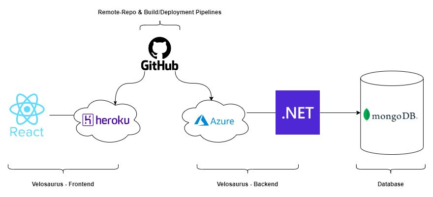

# Velosaurus - Backend

- Backend: **ASP.Net Core**
- Frontend: **React**
- Database:  **Postgres** ~~MongoDB~~
- Repo & Pipelines: **Github**
- Hosting: [**Heroku**](https://dashboard.heroku.com/) amd [**Azure**](https://portal.azure.com/)
- DevOps: [**Azure DevOps**](https://dev.azure.com/)



## Prerequisites

- .NET 9 SDK
- Postgres
- Docker (if run containerized)
- Seq (optional - Serilog Sink 
  - https://datalust.co/download)
  - `seq service status`
  - `seq service start`
  - `seq config get -k api.listenUris`
- PGAdmin (optional)

## Run App

### local

- `dotnet run`
- Serilog Seq sink: <http://localhost:5341/#/events>
- App: <https://localhost:7269/swagger/index.html> or <https://localhost:7019/swagger/index.html>

### docker

- `docker-compose up` or `docker compose up --build`
- App: 
  - <http://localhost:8000/swagger/index.html>
  - <http://localhost:8000/api/Activity/1>
- PGAdmin: <http://localhost:8002/browser/>
  - to get Host name/address: `docker inspect <database> | grep IPAddress`
  - name: velosaurus
  - host: name / address: IPAddress
  - Port: 5432
  - username: postgres  (as defined in docker-compose.yml)
  - password: password  (as defined in docker-compose.yml)
- Serilog Seq sink: <http://localhost:5341/#/events>  (optional, has to be installed)
  - TODO: seq in container ???
- `docker compose down -v`  

### Issues

- Linux postgres port problems: check port usage `sudo lsof -i :5434` and `sudo kill -9 <PID>`
  - adapt docker-compose.yml:

  ```yml
  velosaurusdb:
    ports:
      - "5434:5432"
  ```

## Database (Postgres)

### Postgres database updates (Migrations)

- `Add-Migration MigrationDescription`
- `Update-Database`

### psql in docker container

- `docker exec -it velosaurus-db psql -U postgres`

### Postgres commands

```shell
psql -U postgres
\l 
\c <dbname>
\d
SELECT table_name, column_name, data_type FROM information_schema.columns WHERE table_name='Activities';
SELECT * from "Activities";
```

## Setup project

- Create Project and Solution `ASP.NET Core Web API`
- **CORS** configuration [Link](https://docs.microsoft.com/en-us/aspnet/core/security/cors?view=aspnetcore-6.0)
- **Serilog** and **Seq**
  - **ps script** for checking and starting mongodb and seq service
- Database driver and configuration (Secrets for Credentials)
  - Postgres ~~MongoDB~~

## Github Pipeline

- File paths arerelative to the root of the repository (GitHub Actions workflows run in the context of your repository.)
- **Github Secret** and **env vars** for connectionstring
- **main_velosaurus-api.yml** adaption to substitute before deployment

## Next steps

- location properties: name, summit, mountain range, subgroup
  - e.g. Mutters, Saile, Stubai Alps, Kalkkögel


- Environments Dev / Prod(Demo)
- UnitTests
- Github Pipeline cleanup and optimization
- Patterns:
  - Unit Of Work ?
  - Repository Pattern ?
  - CQRS ? (Probably complete overkill)

- DEPLOYMENT?

## Remarks

### Docker

- **Dockerfile** / **docker-compose.yml**
- `docker build -t velo-image .`
- `docker run --name velo-container -p 8000:80 velo-image`
- <http://localhost:8000/swagger>

### Seq

- **Install** seq and use **Sink** in `appsettings.json`
- Using RequestID in search to find all request related stuff: `RequestId = "0HMHQ499O1RPJ:0000001B"`

### MongoDB

- NO Entityframework Core (best for relational databases!)
- MongoDb.Driver nuget
- <https://docs.microsoft.com/en-us/aspnet/core/tutorials/first-mongo-app?view=aspnetcore-6.0&tabs=visual-studio>
- <https://www.youtube.com/watch?v=exXavNOqaVo>

- Add configuration and configuration model
  - `appsettings.json`
  - settings class in `Models` directory, to store appsettings properties
  - `Program.cs`

### Json Serializer

- <https://docs.microsoft.com/en-us/aspnet/core/web-api/advanced/formatting?view=aspnetcore-6.0#configure-systemtextjson-based-formatters>

## Resources

Docker:

- <https://docs.divio.com/en/latest/reference/docker-docker-compose/>
- <https://devopscell.com/docker/docker-compose/volumes/2018/01/16/volumes-in-docker-compose.html>
- `./CreateSchema.sql:/docker-entrypoint-initdb.d/CreateSchema.sql`

MongoDB:

- <https://www.mongodb.com/developer/languages/csharp/build-first-dotnet-core-application-mongodb-atlas/>
- <https://www.mongodb.com/languages/how-to-use-mongodb-with-dotnet>

Deployment Links:

- <https://velosaurus-api.azurewebsites.net/swagger/index.html>
- <https://velosaurus-api.azurewebsites.net/>
- <https://github.com/OliverZott/velosaurus-backend/actions>
- <https://portal.azure.com/>
- <https://cloud.mongodb.com/>

Serilog:

- <https://www.youtube.com/watch?v=MYKTwvowMUI>
- <https://www.youtube.com/watch?v=hJ0QHRV3RPQ>
  - <https://github.com/rstropek/htl-leo-pro-5/tree/master/lectures/0500-api-error-handling/WebApiErrorHandling.Server>
- <https://www.youtube.com/watch?v=_iryZxv8Rxw>
